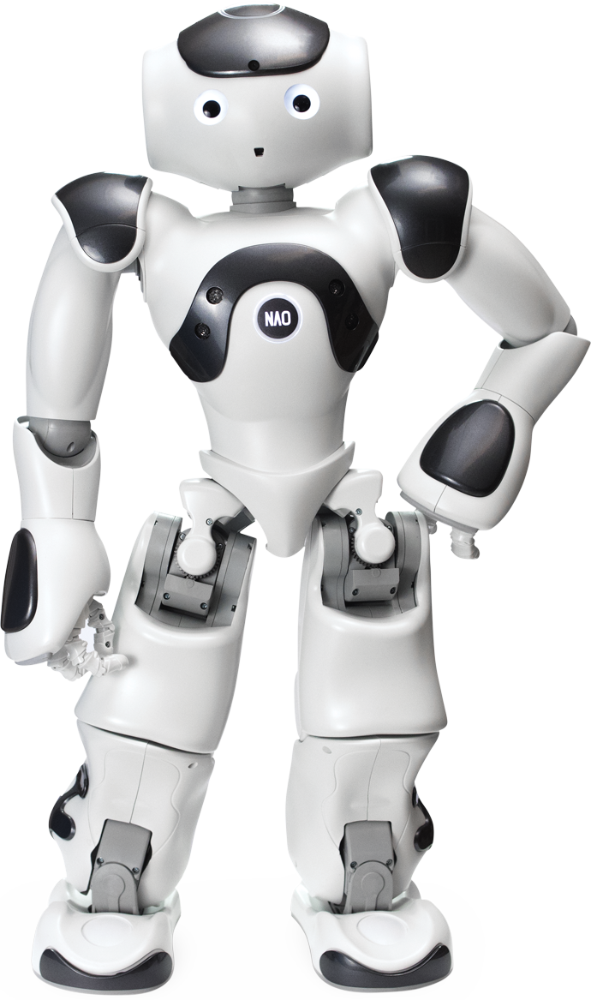
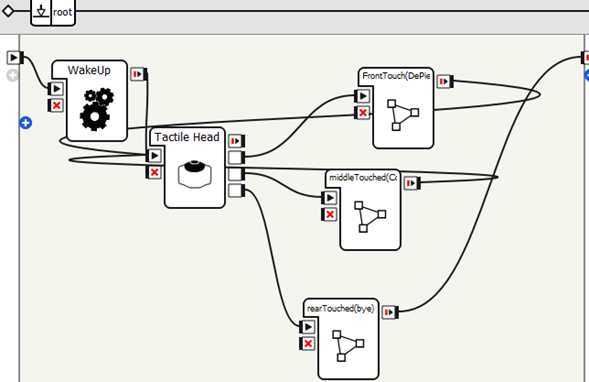
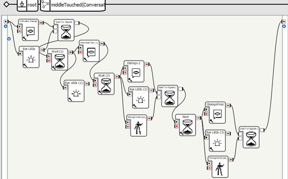
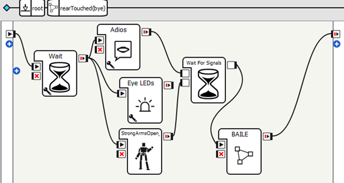
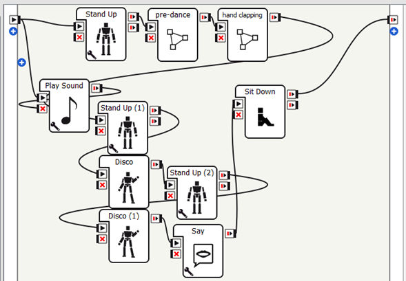

<h1 align="center">
    
  <b>NAO</b>
</h1>

<b>Personal Project • Test Robot NAO • English/Español</b>  

### Headtouch-test
`Eng`

This module aims to provide an initial overview of the NAO robot's capabilities. A presentation routine was developed to showcase the robot's movements within a limited range, utilizing three sensors located on its head. The associated functions, such as arm movements, positions, and LED color changes, were programmed using Choregraphe software.

`Esp`

Este módulo tiene como objetivo ofrecer una primera aproximación a las capacidades del robot NAO. Se desarrolló una rutina de presentación en la que se exhiben los movimientos del robot dentro de un rango limitado, activando tres sensores ubicados en su cabeza. Las funciones asociadas, como los movimientos de los brazos, las posiciones y los cambios de colores de los LED, fueron programadas mediante el software Choregraphe.

________________________________________
### **FrontTouch**
`Eng`

In this phase, the robot stands up and performs a series of arm movements, accompanied by LED color changes. The execution times for both movements and voice actions are ensured through the use of ‘wait’ signals.

`Esp`

En esta fase, el robot se posiciona de pie y realiza una serie de movimientos con los brazos, acompañados de cambios en los colores de los LED. Se garantiza que los tiempos de ejecución de los movimientos y las acciones vocales sean respetados mediante el uso de señales de ‘espera’.

  
  

________________________________________
### **MiddleTouched**
`Eng`

This phase simulates a short conversation with the robot. After each interaction, a 3-second wait time is inserted. The routine includes four short dialogues that culminate in the closure of the conversation.

`Esp`

Aquí se simula una breve conversación con el robot. Después de cada interacción, se inserta un tiempo de espera de 3 segundos. La rutina incluye cuatro diálogos cortos que culminan en el cierre de la conversación.

  
  

________________________________________
### **RearTouched**
`Eng`

In this phase, the robot performs a simple farewell, followed by a small dance with clapping movements. Light effects, such as a "Disco" mode, are also included, and the robot finishes by sitting down.

`Esp`

En esta fase, el robot realiza una despedida sencilla, acompañada de un pequeño baile con movimientos para aplaudir. También se incluyen efectos de luces, como el cambio a un modo "Disco", y el robot finaliza sentándose.

  
  
  

________________________________________
### Project Objective
`Eng`

The purpose of this project is to demonstrate the basic capabilities of the NAO robot, focusing on its interaction through sensors and programmed movements. The implementation of this routine aims to serve as an introduction to robot programming and autonomous operation using the Choregraphe software.

`Esp`

Este proyecto tiene como finalidad demostrar las capacidades básicas del robot NAO, enfocándose en su interacción a través de sensores y movimientos programados. La implementación de esta rutina busca servir como una introducción al uso del robot y a la programación autónoma mediante el software Choregraphe.
